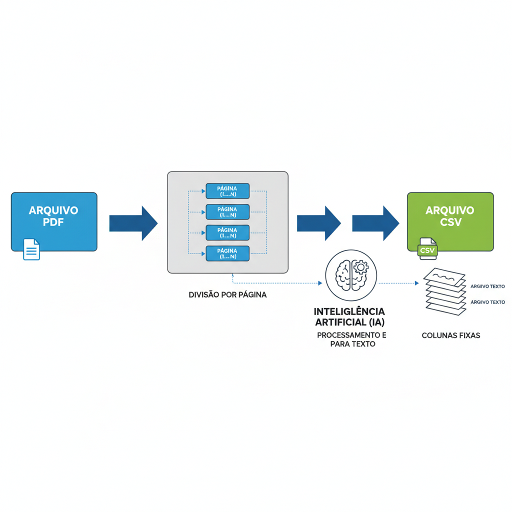
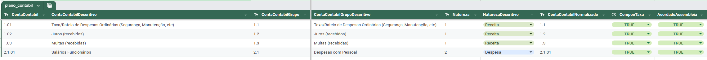

# Extrator de documentos de Prestação de contas do sistema Condomob

[](https://sonarcloud.io/summary/new_code?id=claytonsilva_condomob-documents-ocr2data)
[](https://github.com/claytonsilva/condomob-documents-ocr2data/actions/workflows/github-code-scanning/codeql)
[](https://github.com/claytonsilva/condomob-documents-ocr2data/actions/workflows/dependabot/dependabot-updates)
[](https://github.com/claytonsilva/condomob-documents-ocr2data/actions/workflows/standard.yml)

## Sobre o projeto

O Aplicativo [Condomob](https://condomob.net/) possui um sistema de
retaguarda que auxilia síndicose administradoras com toda o rito de
cobrança e prestação de contas aos moradores, e no sistema de
prestação de contas, temos o formato em pdf, no qual para fins de
análise de desempenho financeiro, recebi a negativa do condomínio
que moro o acesso dos mesmos relatórios em formato mais estruturado
para análise (excel ou csv por exemplo).

Diante da negativa, construí essa aplicação que
faz um "pipeline" partindo de um arquivo grande em pdf e
extrai página a página convertendo o conteúdo pdf
para um formato texto tabulado com ascii, do formato
tabulado, converto novamente para o formato csv,
que é o formato que necessito para
fazer análise de dados.

## Fluxo da extração de dados

Mensalmente a administradora do condomínio divulga através do
aplicativo de moradores um arquivo que contém mais de 1000 páginas
demonstrando todo o fluxo financeiro, desde balancete até compartilhamento
de comprovantes financeiros das transações representadas. O capítulo do
relatório referente ao "Demonstrativo Analítico de Receitas e Despesas" é
o capítulo mais interessante para uma primeira análise será a primeira
parte que esse código irá extrair.

* Primeiramente identificamos as páginas no índice que identificam onde
começa e onde termina o capítulo do demonstrativo.
* Depois de identificado a `Página_inicial` e `Página_final`,
é executado primeira etapa de extração:

```bash
 python src/main.py analytical run  ~/<caminho_do_arquivo_de_entrada>/2023-12.pdf  --start=<Página_inicial> --end=<Página_final>
```

Opcionalmente posso enviar os dados diretamente a uma base de dados
BigQuery devidamente configurado no meu ambiente:

```bash
 python src/main.py analytical run  ~/<caminho_do_arquivo_de_entrada>/2023-12.pdf  --start=<Página_inicial> --end=<Página_final> --upload
```

Para mais opções podemos olhar o próprio help:

```bash
 python src/main.py analytical run  --help
```

O processo segue o diagrama ilustrado abaixo:



## Pré-configurando o ambiente

Um arquivo `.env.example` está disponibilizado junto
com o código fonte onde poderá ser configurado o ambiente

```.env

GOOGLE_CLOUD_PROJECT="project in google cloud"
GOOGLE_CLOUD_BIGQUERY_DATASET_ID="id of the dataset"
GOOGLE_CLOUD_BIGQUERY_TABLE_ID_ANALYTICAL=analytical
LLMWHISPERER_BASE_URL_V2="https://llmwhisperer-api.us-central.unstract.com/api/v2"
LLMWHISPERER_API_KEY="your token from llmwhisperer-api"
LLMWHISPERER_LOGGING_LEVEL="INFO"
GOOGLE_APPLICATION_CREDENTIALS="your google cloud credentials json stored, see more in https://cloud.google.com/docs/authentication/application-default-credentials?hl=pt-br"
GOOGLE_SHEET_ACCOUNT_PLAN_ANALYTICAL_URL="url to access anlytical config details in csv"
GOOGLE_SHEET_RENAMED_UNITS_ANALYTICAL_URL="url to access relation units to rename if necessary"

```

A inteligência artificial que converte o arquivo pdf é
o [LLMWhisperer](https://unstract.com/llmwhisperer/) onde no
nosso modelo de uso tem limite de 100 páginas por dia,
o que permitiu que fizéssemos uma extração por dia,
pois o livro financeiro tinha aproximadamente 100 páginas
em média.

Existe uma implementação em docling, mas ela acabou não passando
nos testes iniciais, mas sua implementação foi mantida para que
possa ser implementada em um futuro não tão distante.

Uma vez configurado o `.env` é necessário configurar as planilhas de apoio:

* [GOOGLE_SHEET_ACCOUNT_PLAN_ANALYTICAL_URL](./docs/resources/resultado-analise-contacontabil.csv) - é uma planilha que contém as
contas contábeis utilizadas na prestação de contas, com seu nome "Normalizado"
e o código ajustado de forma "uniforme" caso seja encontrado formas diferentes
de uma conta semelhante (ex: 1.01 e 1.001) na coluna
ContaContabilNormalizado, e outras informações para
compor os dados como por exemplo "CompoeTaxa" para saber os
lançamentos que entram na composição da taxa do condomínio
e "AcordadoAssembleia" para identificar as despesas extras
que estavam acordado em assembléia.



* [GOOGLE_SHEET_RENAMED_UNITS_ANALYTICAL_URL](./docs/resources/relacao_unidades_renomeadas.csv) - devido a uma
mudança de nomenclatura no condomínio em que esse modelo foi desenvolvido,
foi necessário fazer uma tabela das novas unidades para que o
sistema pudesse colocar a nomenclatura nova recursivamente em todos
os anos anteriores.

## Estrutura do projeto

O projeto foi desenvolvido em python, devido sua facilidade
de lidar com manipulação de dados (usando pandas por exemplo)
e uma visão futura de que iremos implementar um [RAG](https://aws.amazon.com/pt/what-is/retrieval-augmented-generation/) com os dados
extraídos desse projeto.

Foi utilizado [poetry](https://python-poetry.org/) para gestão do
projeto e dependencias, [Ruff](https://docs.astral.sh/ruff/) para
padronizar a codificação e [pytest](https://docs.pytest.org/en/stable/)
para testar o código e manter uma cobertura
aceitável.

A análise de qualidade do projeto pode ser observado
no [SonarCloud](https://sonarcloud.io/project/overview?id=claytonsilva_condomob-documents-ocr2data).

```markdown
project
│   README.md
│   pyproject.toml
│   ...
│
└───src
│   │   main.py
│   │   analytical.py
│   │   agreements.py (será implementado em um futuro breve)
│   │
│   └───services
│       │   <serviços de terceiros de apoio>
│       │   ...
│       │
│       └───utils
│       │   <funções menores de propósito variado>
│       │   ...
│       │
│       └───processors
│       │   <funções responsáveis em converter do pdf para a primeira versão bruta em texto>
│       │   ...
│       │
│       └───rp_transformers
│       │   <funções responsáveis por transformar o texto extraído em csv com as informações ricas>
│       │   ...
│       │
│       └───docs
│          <recursos da documentação>
│          ...
│
└───tests
    │   <repetindo a estrutura de src, mas com os arquivos de testes>
```
